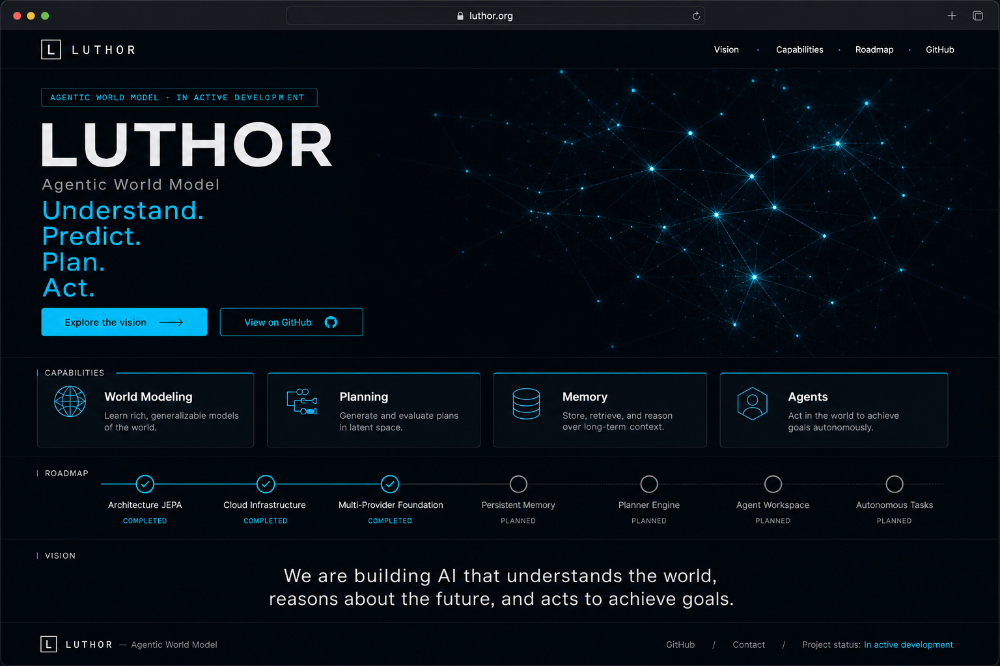
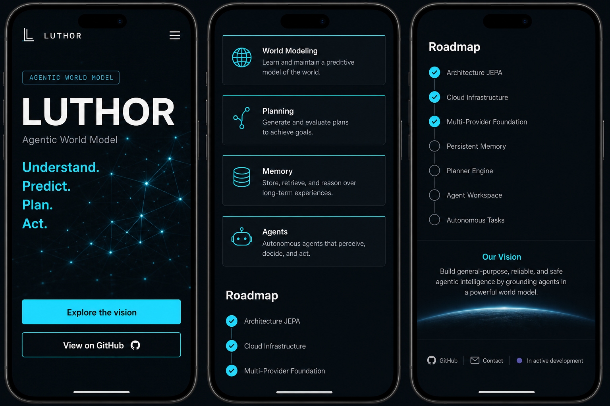

# LUTHOR — Landing Page V1 (Visibility)

> **Mission** : remplacer la page « En construction » de `luthor.org` par une landing page crédible qui rend visible la vision de LUTHOR.
>
> **Périmètre** : vitrine uniquement. Ce document ne touche **ni** au backend Python, **ni** au JEPA, **ni** aux providers LLM, **ni** à Cloud Run, **ni** à l'architecture. Il décrit le contenu, l'UX et le design de la page publique.
>
> **Objectif de compréhension (≤ 15 s)** : en arrivant sur la page, le visiteur doit saisir **(1)** ce qu'est LUTHOR, **(2)** pourquoi il existe, **(3)** où il va.
>
> **Positionnement** : LUTHOR est un **projet en construction avancée** (prototype + recherche), pas un produit fini. On expose une **vision** et un **état d'avancement honnête**, sans survendre.

---

## 1. Direction artistique

Référence visuelle : laboratoires de recherche IA (**Meta FAIR**, DeepMind, Anthropic). Sobre, premium, technique. **Aucun** jargon marketing creux, aucune promesse fictive.

### Palette
| Rôle | Couleur | Hex |
| :--- | :--- | :--- |
| Fond principal | Charcoal profond | `#0F1419` |
| Texte principal | Blanc cassé | `#F4F6F8` |
| Texte secondaire | Gris | `#9AA4AF` |
| Accent (unique) | Cyan électrique | `#00D9FF` |
| Accent secondaire | Indigo | `#6366F1` |
| Bordures / hairlines | Gris très sombre | `#1E2630` |

### Typographie
- **Titres** : géométrique / grotesque (Space Grotesk, Poppins) — Bold 700.
- **Corps** : Inter — 400 / 500.
- **Labels techniques & badges** : Space Mono (petits libellés type `// agentic world model`).

### Principes
- **Mobile-first**, puis montée en gamme desktop.
- Beaucoup d'espace négatif ; hiérarchie typographique forte ; **un seul** accent lumineux (cyan) utilisé avec parcimonie.
- Motif récurrent discret : un **espace latent** abstrait (réseau clairsemé de nœuds + lignes), en faible opacité, jamais tape-à-l'œil.
- Animations légères (fade-in au scroll). Pas d'effets criards.

---

## 2. Maquettes

### 2.1 Desktop


### 2.2 Mobile


> Les images ci-dessus sont des **maquettes de référence** (intention visuelle). Les textes faisant foi sont ceux des sections 4 et 5 de ce document.

---

## 3. Architecture UX de la page

One-pager, scroll vertical. Ordre des sections :

```
┌─────────────────────────────────────────────┐
│  NAV   L · LUTHOR        Vision Capabilities  │  ← fixe, translucide
│                          Roadmap   GitHub     │
├─────────────────────────────────────────────┤
│  1. HERO                                      │
│     badge · Agentic World Model · LUTHOR      │
│     « plain subtitle » des 15 s               │
│     Understand. Predict. Plan. Act.           │
│     [See how it works] [View on GitHub]       │
├─────────────────────────────────────────────┤
│  2. PRÉSENTATION / APPROACH (#approach)       │
│     World Model · ≠ chatbot · pourquoi        │
├─────────────────────────────────────────────┤
│  3. CAPACITÉS  (4 cartes)                     │
│     World Modeling · Planning · Memory · Agents│
├─────────────────────────────────────────────┤
│  4. ROADMAP                                   │
│     ✓ acquis     ◯ à venir                     │
├─────────────────────────────────────────────┤
│  5. VISION                                    │
│     mission long terme, sans survendre        │
├─────────────────────────────────────────────┤
│  6. FOOTER                                    │
│     GitHub · Contact · Statut du projet       │
└─────────────────────────────────────────────┘
```

### Flux de lecture (parcours cible en 15 s)
1. **Hero** → eyebrow « Agentic World Model » + **phrase en clair** + verbes `Understand / Predict / Plan / Act` → **(1) ce que c'est** (sans jargon).
2. **Présentation / Approach** → différence avec un chatbot + « pour qui » → **(2) pourquoi ça existe**.
3. **Capacités + Roadmap** → ce qui est fait / à venir → **(3) où ça va**.
4. **Vision / CTA** → comment suivre ou contribuer (pas « utiliser »).

### Wireframe mobile (mobile-first)
```
[≡]  L LUTHOR
─────────────
// RESEARCH PROJECT — IN ACTIVE DEVELOPMENT
Agentic World Model
LUTHOR

An AI that learns a model of the world —
to predict, plan, and act.

Understand. Predict. Plan. Act.

A prototype today, not a product yet.

[ See how it works ]   (cyan, pleine largeur)
[ View on GitHub    ]   (outline, pleine largeur)
─────────────
PRÉSENTATION (texte court)
─────────────
[ Carte ] World Modeling
[ Carte ] Planning
[ Carte ] Memory
[ Carte ] Agents
─────────────
ROADMAP
 ✓ Architecture JEPA
 ✓ Cloud Infrastructure
 ✓ Multi-Provider Foundation
 ◯ Persistent Memory
 ◯ Planner Engine
 ◯ Agent Workspace
 ◯ Autonomous Tasks
─────────────
VISION (texte court)
─────────────
FOOTER  GitHub · Contact · Statut
```

### Règles responsive
- **Breakpoints** : mobile `< 768px` (1 colonne), tablette `768–1024px` (2 colonnes pour les cartes), desktop `> 1024px` (4 colonnes).
- **Hero** : tagline empilée sur 4 lignes en mobile, peut passer en ligne unique espacée sur desktop.
- **Boutons** : pleine largeur empilés en mobile, côte à côte en desktop.
- **Cartes capacités** : 1 col → 2 col → 4 col.
- **Roadmap** : liste verticale en mobile, timeline 2 colonnes (acquis | à venir) possible en desktop.

---

## 4. Contenu prêt à l'emploi — 🇬🇧 English (version principale)

> L'anglais est proposé comme version principale (codes de la recherche IA). La version FR suit en section 5.

### 4.1 Navigation
- Logo : `L` + **LUTHOR**
- Liens : `Vision` · `Capabilities` · `Roadmap` · `GitHub`

### 4.2 Hero
**Badge :**
```
// RESEARCH PROJECT — IN ACTIVE DEVELOPMENT
```
**Eyebrow (au-dessus du titre) :**
```
Agentic World Model
```
**Titre (H1) :**
```
LUTHOR
```
**Sous-titre (langage simple — la phrase des 15 secondes) :**
```
An AI that learns a model of the world — to predict, plan, and act,
instead of just generating text.
```
**Tagline (4 mots, accent cyan) :**
```
Understand.  Predict.  Plan.  Act.
```
**Microcopie d'attente (sous la tagline, petit, gris) :**
```
An open research project. A prototype today, not a product yet.
```
**Boutons :**
```
[ See how it works ]   → #approach
[ View on GitHub ]     → https://github.com/ChawnRob/Luthor
```

### 4.3 Présentation
**Titre (H2) :**
```
Not a chatbot. A model of the world.
```
**Corps :**
```
A world model is an AI that learns an internal representation of its environment
— so it can anticipate what happens next and reason about its own actions.

Most assistants today predict the next word. Luthor explores a different
direction: predicting how a situation evolves, in an abstract representation
space, and using that to plan toward a goal.

Why it matters: reasoning in this latent space aims for agents that are more
coherent over time, more autonomous, and more compute-efficient than systems
that must generate everything as text.

Luthor's reasoning core is non-generative (JEPA). A language-model layer is an
optional interface — not the brain.

Who it's for: researchers, developers, and anyone curious about agentic AI and
world models.
```

### 4.4 Capacités (4 cartes)
**Titre (H2) :** `Capabilities`

```
World Modeling
Learn a compact, abstract representation of the environment instead of
reconstructing every detail.

Planning
Simulate possible futures, score each trajectory, and choose the action that
moves closest to the goal.

Memory
A persistent internal state designed to reason over the long term without
regenerating context at every step.

Agents
The direction we're building toward: autonomous agents that break a goal into
steps and execute them, correcting course along the way.
```
> Honnêteté : « Memory » et « Agents » sont formulés comme **objectifs en cours** (`designed to`, `the direction we're building toward`).

### 4.5 Roadmap
**Titre (H2) :** `Roadmap`
**Intro :**
```
What exists today, and what we're building next.
```
**Foundations (today) :**
```
✓  JEPA-based prototype       — Encoder · predictor · planner (open source)
✓  Containerized deployment   — Runs on Cloud Run
✓  Pluggable LLM layer        — Optional, provider-agnostic interface
```
**Next (planned) :**
```
◯  Persistent Memory            — Long-term internal state
◯  Planner Engine               — Stronger search beyond random sampling
◯  Agent Workspace              — Environment for autonomous agents
◯  Autonomous Tasks             — Goal decomposition and execution
```
> Pas de dates. Les ✓ sont des **briques de fondation** (le mot *prototype* reste visible), pas des fonctionnalités produit prêtes à l'emploi. Les ◯ sont **planifiés**, pas livrés.

### 4.6 Vision
**Titre (H2) :** `Vision`
```
Luthor is a long-term effort to build AI that understands, predicts, plans, and
acts — agents grounded in a model of the world rather than in text generation
alone.

We're inspired by research on Autonomous Machine Intelligence (AMI) and Joint
Embedding Predictive Architectures (JEPA). Today, Luthor is an open prototype
under active development. We're sharing the journey as we build it — one
capability at a time.
```

### 4.7 Footer
```
LUTHOR — Agentic World Model
An open research project · In active development

Approach   → #approach
GitHub     → github.com/ChawnRob/Luthor    ★ Star the repo
License    → MIT   (à confirmer)
Contact    → contact@luthor.org   (à confirmer)

© Luthor. Inspired by AMI / JEPA principles.
```

---

## 5. Contenu prêt à l'emploi — 🇫🇷 Français

### 5.1 Navigation
- Logo : `L` + **LUTHOR**
- Liens : `Vision` · `Capacités` · `Roadmap` · `GitHub`

### 5.2 Hero
**Badge :**
```
// PROJET DE RECHERCHE — EN CONSTRUCTION AVANCÉE
```
**Eyebrow (au-dessus du titre) :** `Agentic World Model`
**Titre (H1) :** `LUTHOR`
**Sous-titre (langage simple — la phrase des 15 secondes) :**
```
Une IA qui apprend un modèle du monde — pour prédire, planifier et agir,
au lieu de seulement générer du texte.
```
**Tagline (accent cyan) :**
```
Understand.  Predict.  Plan.  Act.
```
> Recommandation : garder la tagline en anglais (signature du projet), même sur la version FR.

**Microcopie d'attente (petit, gris) :**
```
Un projet de recherche ouvert. Un prototype aujourd'hui, pas encore un produit.
```
**Boutons :**
```
[ Voir comment ça marche ]   → #approach
[ Voir sur GitHub ]          → https://github.com/ChawnRob/Luthor
```

### 5.3 Présentation
**Titre (H2) :**
```
Pas un chatbot. Un modèle du monde.
```
**Corps :**
```
Un modèle du monde (« world model ») est une IA qui apprend une représentation
interne de son environnement — pour anticiper ce qui va se passer et raisonner
sur ses propres actions.

La plupart des assistants prédisent le mot suivant. Luthor explore une autre
voie : prédire l'évolution d'une situation, dans un espace de représentation
abstrait, et s'en servir pour planifier vers un objectif.

Pourquoi c'est intéressant : raisonner dans cet espace latent vise des agents
plus cohérents dans la durée, plus autonomes, et plus économes en calcul que des
systèmes qui doivent tout produire sous forme de texte.

Le cœur de raisonnement de Luthor est non génératif (JEPA). Une couche de modèle
de langage est une interface optionnelle — pas le cerveau.

Pour qui : chercheurs, développeurs, et toute personne curieuse de l'IA
agentique et des modèles du monde.
```

### 5.4 Capacités (4 cartes)
**Titre (H2) :** `Capacités`
```
World Modeling
Apprendre une représentation abstraite et compacte de l'environnement, au lieu
d'en reconstruire chaque détail.

Planning
Simuler plusieurs futurs possibles, évaluer chaque trajectoire, et choisir
l'action qui rapproche le plus de l'objectif.

Memory
Un état interne persistant pensé pour raisonner sur le long terme, sans tout
regénérer à chaque étape.

Agents
La direction que nous construisons : des agents autonomes qui décomposent un
objectif en étapes et les exécutent, en se corrigeant en cours de route.
```

### 5.5 Roadmap
**Titre (H2) :** `Roadmap`
**Intro :** `Ce qui existe aujourd'hui, et ce que nous construisons ensuite.`
**Fondations (aujourd'hui) :**
```
✓  Prototype basé sur JEPA      — Encodeur · prédicteur · planificateur (open source)
✓  Déploiement conteneurisé     — Tourne sur Cloud Run
✓  Couche LLM enfichable        — Interface optionnelle, agnostique au fournisseur
```
**À venir (planifié) :**
```
◯  Persistent Memory            — État interne long terme
◯  Planner Engine               — Recherche plus avancée que l'échantillonnage
◯  Agent Workspace              — Environnement pour agents autonomes
◯  Autonomous Tasks             — Décomposition et exécution d'objectifs
```
> Les ✓ sont des **briques de fondation** (le mot *prototype* reste visible), pas des fonctionnalités produit. Les ◯ sont **planifiés**, pas livrés.

### 5.6 Vision
**Titre (H2) :** `Vision`
```
Luthor est un projet de long terme : construire une IA qui comprend, prédit,
planifie et agit — des agents ancrés dans un modèle du monde, et pas seulement
dans la génération de texte.

Nous nous inspirons des travaux sur l'Intelligence Machine Autonome (AMI) et les
Joint Embedding Predictive Architectures (JEPA). Aujourd'hui, Luthor est un
prototype open source en construction avancée. Nous partageons cette
construction au fil de l'eau — une capacité à la fois.
```

### 5.7 Footer
```
LUTHOR — Modèle du Monde Agentique
Un projet de recherche ouvert · En construction avancée

Approche   → #approach
GitHub     → github.com/ChawnRob/Luthor    ★ Star le repo
Licence    → MIT   (à confirmer)
Contact    → contact@luthor.org   (à confirmer)

© Luthor. Inspiré des principes AMI / JEPA.
```

---

## 6. Notes d'intégration

- **Ancres** : `#approach` (Présentation), `#capabilities` / `#capacites`, `#roadmap`, `#vision`, `#contact`.
- **Lien GitHub** : `https://github.com/ChawnRob/Luthor`.
- **Contact** : `contact@luthor.org` *(placeholder — à confirmer)*.
- **Séparation des domaines** : `luthor.org` = vitrine ; `app.luthor.org` = future application / API (Cloud Run). Ne pas exposer de lien `app.` tant que rien n'est en ligne.
- **SEO** :
  - Titre : `LUTHOR — Agentic World Model`
  - Description : `Luthor, an open Agentic World Model in active development: understand, predict, plan, act. Inspired by JEPA / AMI.`
  - Image Open Graph : visuel sombre, logo + accent cyan.

---

## 7. Garde-fous (contraintes respectées)

- ✅ **Aucune modification de code** : backend Python, JEPA, providers, Cloud Run et architecture restent intacts. Livraison = doc + maquettes.
- ✅ **Mobile-first** et **style premium / recherche IA** (Meta FAIR).
- ✅ **Pas de jargon marketing vide**, **pas de promesses fictives** : les capacités non livrées (Memory, Agents, items ◯ de la roadmap) sont explicitement présentées comme **en cours / planifiées**.
- ✅ **LUTHOR = projet en construction avancée**, pas produit fini.
- ✅ **Vision claire** : Agentic World Model → understand, predict, plan, act.
- ✅ **COCO / OpenChawn** : volontairement **absent** de cette vitrine (séparation stricte).

---

## 8. Journal de révision — Review Pass (4 profils)

Relecture du document selon 4 profils : visiteur lambda, ingénieur Meta FAIR, investisseur IA, développeur open-source. Synthèse des correctifs **appliqués dans ce document** (aucun merge effectué) :

| # | Correctif appliqué | Profil servi |
| :--- | :--- | :--- |
| 1 | Sous-titre hero **en langage simple** (phrase des 15 s) ; `Agentic World Model` repassé en *eyebrow* | Visiteur |
| 2 | Clarification **world model ≠ LLM** (cœur non génératif JEPA ; couche LLM = interface optionnelle) | FAIR |
| 3 | Roadmap requalifiée : `JEPA-based prototype`, `Containerized deployment`, `Pluggable LLM layer` (mot *prototype* conservé) | FAIR / Dev |
| 4 | Microcopie d'attente : « prototype today, not a product yet » | Visiteur / Dev |
| 5 | CTA `Explore the vision` → `See how it works` (ancre `#approach`) | FAIR / Dev |
| 6 | Ajout **« Who it's for »** (chercheurs, devs, curieux) | Investisseur |
| 7 | Footer enrichi **open source** : licence (MIT, à confirmer), `★ Star the repo`, lien Approach | Dev |
| 8 | Wireframes + flux de lecture alignés sur le nouveau hero et l'ancre `#approach` | Tous |

### Top 5 risques de confusion (suivi)
1. World model vs LLM provider — *traité (#2, #3)*.
2. « Agents / Autonomous Tasks » perçu comme hype — *atténué (#1, #4)*.
3. Roadmap ✓ = produit prêt ? — *traité (#3, #4)*.
4. CTA ambigu — *traité (#5)*.
5. Jargon en tête de page — *traité (#1)*.

### Décisions encore ouvertes (validation humaine requise)
- **Email de contact** : `contact@luthor.org` reste un **placeholder** — à confirmer ou remplacer par un formulaire.
- **Licence** : `MIT` indiquée *à confirmer* (le repo doit contenir un fichier `LICENSE`).
- **Lien GitHub** : confirmer que le repo est **public** avant d'exposer le lien.
- **Statut** : wording « en construction avancée / in active development » à valider.
- **`app.luthor.org`** : aucun lien exposé pour l'instant (recommandé tant que rien n'est en ligne).
- **Langue de la home V1** : EN principale recommandée (FR prête), tagline EN dans les deux cas.
