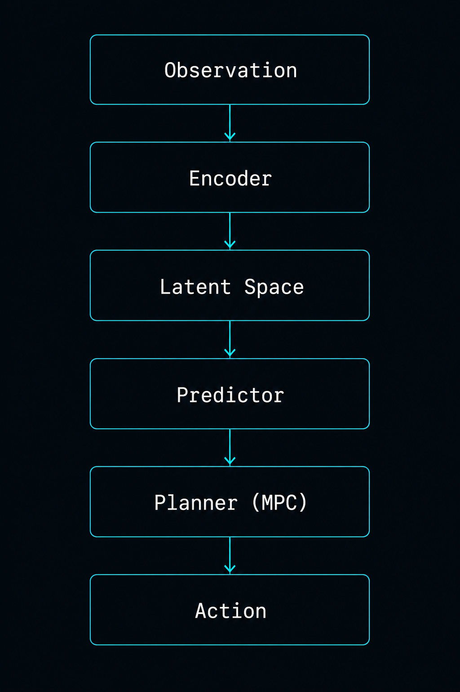
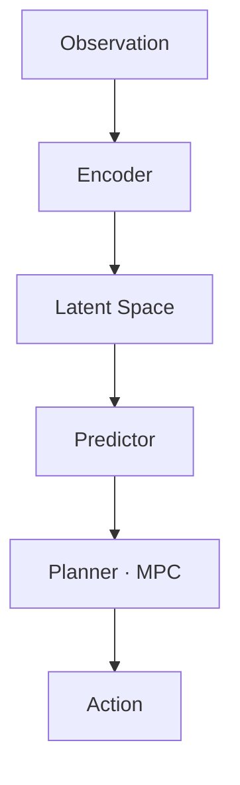
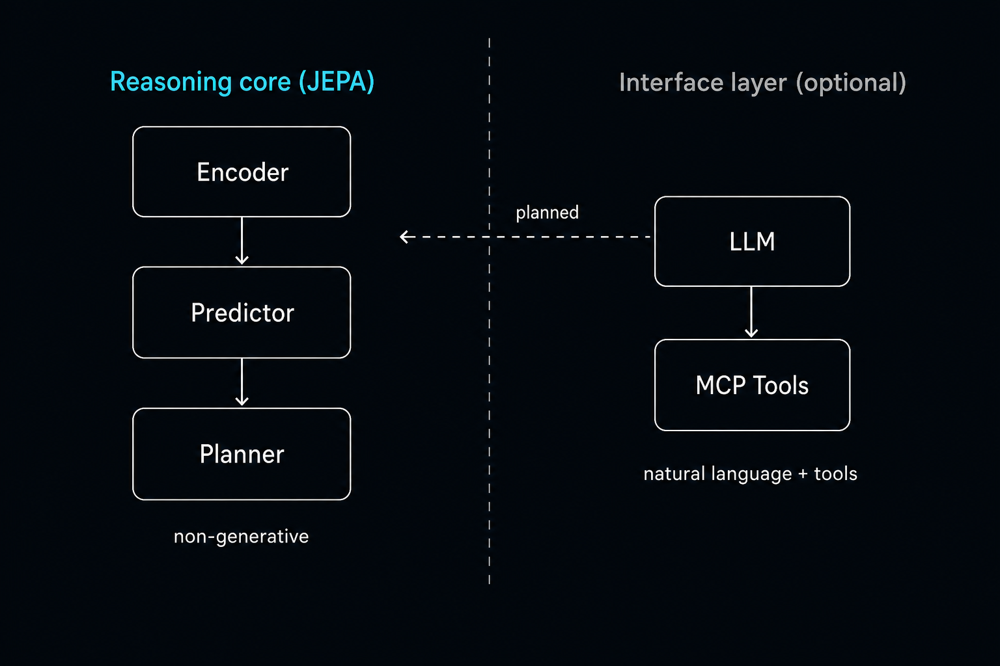
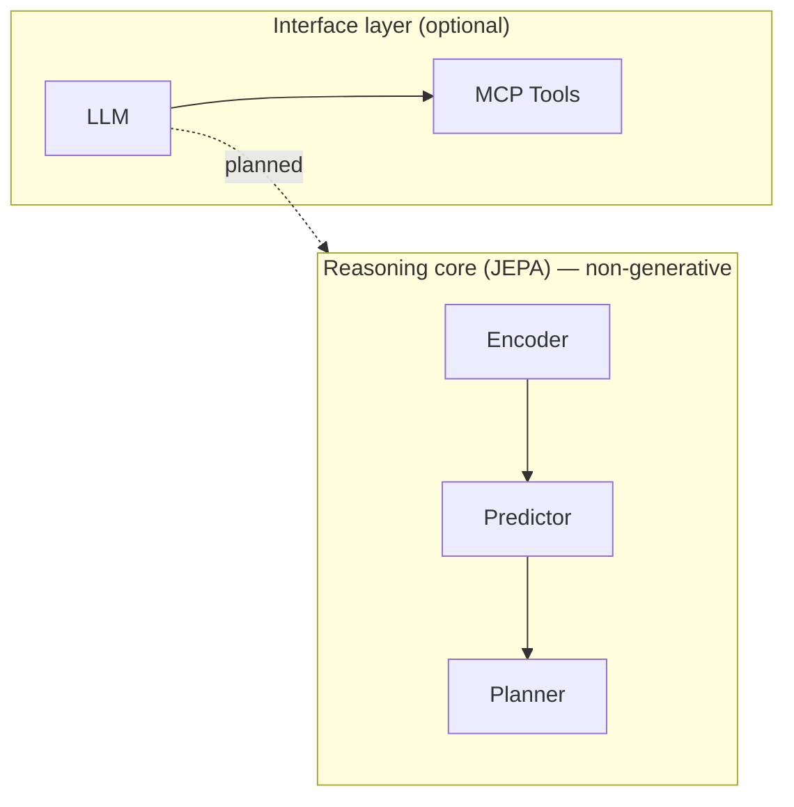

# LUTHOR — Research Landing V1.2 (Public Release)

> **Nature** : version publique, orientée crédibilité scientifique, de la présentation de `luthor.org`. Elle **remplace** les brouillons Landing V1 / About V1 pour la mise en ligne.
>
> **Périmètre** : documentation uniquement. Aucun changement de code, de JEPA, de Cloud Run, de providers, ni de backend. Aucun merge automatique.
>
> **Règle d'or** : **chaque affirmation de cette page doit être justifiable par le dépôt GitHub `ChawnRob/Luthor`.** Les modules cités sont référencés par leur chemin réel.
>
> **Positionnement** : LUTHOR est un **Research Prototype** open source. Pas un produit fini. Pas un chatbot. Pas un wrapper de LLM. Le cœur est un **modèle du monde JEPA** (PyTorch) ; les LLM ne sont qu'une **couche d'interface optionnelle**.

---

## 1. Audit V1.2 (ce qui a été corrigé)

Relecture critique du brouillon V1 au regard du **code réellement présent** aujourd'hui dans le dépôt.

| # | Problème dans V1 | Correction en V1.2 | Justification code |
| :-- | :-- | :-- | :-- |
| 1 | Carte « Agents » + « Autonomous Tasks » suggérait un agent autonome existant | Reformulé : **tool-use piloté par LLM** (function calling → MCP), **pas** un agent autonome qui décompose des objectifs | `src/luthor/orchestrator.py` route des appels d'outils ; aucune décomposition d'objectifs autonome |
| 2 | « Persistent Memory » présentée comme purement future | Précisé : **compression de contexte (GRU) existe** (court terme) ; **mémoire persistante long terme = en cours** | `src/luthor/memory/context_compressor.py` (GRU + buffer glissant) |
| 3 | « Multi-Provider Foundation » vague | Précisé : **6 providers réels** + **fallback SmolLM3 on-demand** + **orchestration MCP**, présentés comme **interface**, pas cerveau | `llm_provider.py`, `orchestrator_llm.py`, `slm_fallback.py`, `mcp/` |
| 4 | Efficacité « economes en calcul » non étayée | Réancré sur un fait vérifiable : **prédicteur à attention linéaire** (Performer/FAVOR+, O(N·d²)) + raisonnement latent non génératif ; **aucun chiffre de benchmark** avancé | `src/luthor/jepa_model/linear_attention.py` |
| 5 | « Planner Engine » pouvait laisser croire à une recherche avancée | Précisé : le planificateur actuel est un **MPC par échantillonnage aléatoire** (random shooting) ; recherche plus forte = vision | `src/luthor/jepa_model/planner.py` |
| 6 | Risque « wrapper de LLM » | Ajout d'un **schéma de séparation** montrant que le cœur JEPA est indépendant du LLM ; l'intégration LLM→world model est marquée **planned** | JEPA (`jepa_model/`) et orchestrateur (`orchestrator.py`) sont deux sous-systèmes distincts |
| 7 | Claims marketing (comparaisons de prix, « 5x moins cher ») | **Exclus** de la landing recherche (restent des docs internes) | `docs/COST_STRATEGY_SME.md` non référencé publiquement |
| 8 | Statut ambigu | **« Research Prototype »** partout ; séparation nette Disponible / En cours / Vision | — |

**Vérifications factuelles retenues pour la page** (toutes justifiables) :
- Noyau JEPA en PyTorch : encodeur, prédicteur (+ variante à attention linéaire), world model, planner MPC. → `src/luthor/jepa_model/`
- Estimation d'incertitude par **MC-dropout**. → `predictor.py::predict_with_uncertainty`
- **Apprentissage actif** par échantillonnage sur l'incertitude, avec oracle. → `src/luthor/active_learning/`
- Environnements **GridWorld** et **Inventory**. → `src/luthor/environment/`
- **API FastAPI** (`/embed`, `/predict`, `/active_learn`, `/health`, `/metrics`) + PostgreSQL/ChromaDB. → `src/luthor/api/`
- **Pipeline reproductible DVC** (prepare_data → train). → `dvc.yaml`, `params.yaml`
- **Couche LLM** multi-provider + orchestration MCP + fallback SmolLM3. → `llm_provider.py`, `orchestrator.py`, `slm_fallback.py`, `mcp/`
- **Suite de tests** : plus de 100 fonctions de test réparties sur 30+ fichiers. → `tests/`

---

## 2. Landing V1.2 — Contenu (🇬🇧 EN principale)

### 2.1 Hero
```
// RESEARCH PROTOTYPE
Agentic World Model

LUTHOR

An open research prototype for world models: an AI that learns to
represent its environment, predict how it evolves, and plan actions —
in an abstract latent space, not by generating text.

Understand.  Predict.  Plan.  Act.

Open source. A research prototype today, not a product.

[ See the architecture ]   [ View on GitHub ]
```
Boutons → `#architecture` · `https://github.com/ChawnRob/Luthor`

### 2.2 What LUTHOR is (`#approach`)
```
Not a chatbot. Not an LLM wrapper. A world model.

LUTHOR learns a compact, abstract representation (a latent space) of an
environment, and a predictor that models how that latent state changes when an
action is taken. A planner then searches over imagined latent trajectories to
choose actions that reach a goal.

The reasoning core is a JEPA-style world model implemented in PyTorch — it is
non-generative and does not depend on any language model. A language model is
used only as an optional interface layer (natural language and tool use).

Who it's for: researchers, ML engineers, and open-source developers interested
in world models, self-supervised representation learning, and planning.
```

### 2.3 Architecture (`#architecture`)
Le pipeline reflète le code réel (`src/luthor/jepa_model/` + `planner.py`) :



Source canonique (Mermaid) :

- **Encoder** (`encoder.py`) — MLP configurable, encodage contextuel optionnel.
- **Latent Space** — représentation abstraite apprise.
- **Predictor** (`predictor.py`) — prédit le latent suivant à partir de (latent, action) ; attention multi-têtes optionnelle ; **incertitude par MC-dropout** ; **variante à attention linéaire** (`linear_attention.py`).
- **Planner · MPC** (`planner.py`) — échantillonne des séquences d'actions, simule les trajectoires latentes, choisit la moins coûteuse (**random shooting**).
- **Action** — première action de la meilleure séquence, appliquée à l'environnement.

> Apprentissage **auto-supervisé, non génératif** : la cible latente de l'observation suivante est encodée puis **détachée** (`encode_target`), le prédicteur apprend la dynamique dans l'espace latent (pas de reconstruction de pixels/texte).

### 2.4 Role of the LLM
Pour éviter toute confusion « wrapper » : le LLM est **à côté** du cœur, pas dedans.




- **Aujourd'hui** : la couche LLM (`orchestrator.py`) fait du **function calling** vers des outils **MCP** (`mcp/`), avec un **fallback SmolLM3 on-demand** (`orchestrator_llm.py`, `slm_fallback.py`). Providers disponibles : DeepSeek (défaut), OpenAI, OpenRouter, Kimi, Mistral, Llama local (`llm_provider.py`).
- **Le LLM ne pilote pas** le world model ni le planner. Le raisonnement vit dans le noyau JEPA.
- **Planifié (non implémenté)** : brancher la couche d'interface pour formuler des objectifs à destination du world model. C'est l'arête `planned` du schéma.

### 2.5 Research
Axes de recherche actuels, compréhensibles sans connaître Meta :
```
Representation Learning   — Learn a compact latent representation of observations.   (encoder.py)
World Models              — Model how the environment evolves, in latent space.      (world_model.py)
Self-Supervised Learning  — Learn from interaction, no labels; detached JEPA target. (training/, demo.py)
Latent Prediction         — Predict the next latent state from (state, action).      (predictor.py)
Uncertainty Estimation    — MC-dropout variance over predictions.                    (predictor.py)
Efficient Sequence Modeling — Linear-attention predictor (Performer/FAVOR+ style).   (linear_attention.py)
Active Learning           — Query the most uncertain transitions to label.           (active_learning/)
Planning                  — Model-predictive control over imagined trajectories.     (planner.py)
Agentic Tool Use          — LLM function-calling to external MCP tools (interface).   (orchestrator.py, mcp/)
```

### 2.6 Current Status
Séparation stricte, sans ambiguïté.

**Available today** — *présent et testé dans le dépôt*
```
✓  JEPA world model in PyTorch — encoder, predictor, world model      (jepa_model/)
✓  MC-dropout uncertainty estimation                                  (predictor.py)
✓  Linear-attention (subquadratic) predictor variant                  (linear_attention.py)
✓  MPC planner (random-shooting) over latent trajectories             (planner.py)
✓  GridWorld & Inventory simulation environments                      (environment/)
✓  Active learning (uncertainty sampling + oracle)                    (active_learning/)
✓  FastAPI service: /embed /predict /active_learn /health /metrics    (api/)
✓  PostgreSQL + ChromaDB storage                                      (api/)
✓  Reproducible DVC training pipeline                                 (dvc.yaml, params.yaml)
✓  Multi-provider LLM layer + MCP tool orchestration + SmolLM3 fallback (llm_provider.py, orchestrator.py, mcp/)
✓  Docker / Cloud Run deployment, Prometheus/Grafana monitoring, JWT auth
✓  100+ automated tests                                               (tests/)
```

**In development** — *partiel, en cours*
```
~  Long-term persistent memory (short-term GRU context compression exists)  (memory/)
~  Stronger planning search beyond random shooting (CEM / gradient-based)
~  Wiring the LLM interface to drive world-model goals
~  Richer encoders/predictors and longer planning horizons
```

**Long-term vision** — *prévu, non implémenté*
```
◯  Autonomous agents that decompose goals and execute multi-step tasks
◯  Hierarchical / temporal world models
◯  Multimodal encoders (vision, sensors)
◯  An experimental agent workspace
```
> Aucune date promise. Aucune capacité d'agent autonome n'est présentée comme existante.

### 2.7 Footer
```
LUTHOR — Agentic World Model
An open-source research prototype · Inspired by AMI / JEPA (Y. LeCun)

Architecture  → #architecture
Research      → #research
GitHub        → github.com/ChawnRob/Luthor    ★ Star the repo
Contact       → contact@luthor.org

© Luthor.
```

---

## 3. Landing V1.2 — Contenu (🇫🇷 Français)

### 3.1 Hero
```
// PROTOTYPE DE RECHERCHE
Agentic World Model

LUTHOR

Un prototype de recherche open source sur les modèles du monde : une IA
qui apprend à représenter son environnement, à prédire son évolution et à
planifier ses actions — dans un espace latent abstrait, sans générer de texte.

Understand.  Predict.  Plan.  Act.

Open source. Un prototype de recherche aujourd'hui, pas un produit.

[ Voir l'architecture ]   [ Voir sur GitHub ]
```

### 3.2 Ce qu'est LUTHOR (`#approach`)
```
Pas un chatbot. Pas un wrapper de LLM. Un modèle du monde.

LUTHOR apprend une représentation abstraite et compacte (un espace latent) d'un
environnement, et un prédicteur qui modélise l'évolution de cet état latent sous
l'effet d'une action. Un planificateur cherche ensuite parmi des trajectoires
latentes imaginées les actions qui atteignent un objectif.

Le cœur de raisonnement est un modèle du monde de type JEPA en PyTorch — non
génératif, et indépendant de tout modèle de langage. Un LLM n'est utilisé que
comme couche d'interface optionnelle (langage naturel et usage d'outils).

Pour qui : chercheurs, ingénieurs ML et développeurs open source intéressés par
les modèles du monde, l'apprentissage de représentations auto-supervisé et la
planification.
```

### 3.3 → 3.6
Identiques à §2.3–2.6 (les diagrammes, la Research section et le Current Status sont langue-neutres ; réutiliser les mêmes libellés techniques). Traductions des intitulés de statut : **Disponible aujourd'hui / En développement / Vision long terme**.

### 3.7 Footer
```
LUTHOR — Modèle du Monde Agentique
Un prototype de recherche open source · Inspiré de l'AMI / JEPA (Y. LeCun)

Architecture  → #architecture
Recherche     → #research
GitHub        → github.com/ChawnRob/Luthor    ★ Star le repo
Contact       → contact@luthor.org

© Luthor.
```

---

## 4. Publication Squarespace — spécification finale

### 4.1 Ordre des sections (one-pager)
1. **Hero** (`#top`)
2. **What LUTHOR is** (`#approach`)
3. **Architecture** (`#architecture`) — schéma pipeline
4. **Role of the LLM** — schéma séparation
5. **Research** (`#research`)
6. **Current Status** (`#status`) — Available / In development / Vision
7. **Footer** (`#contact`)

### 4.2 Hiérarchie visuelle
- **H1** : `LUTHOR` (très grand). **Eyebrow** au-dessus : `Agentic World Model` (Space Mono, cyan, petit).
- **H2** par section (Space Grotesk/Poppins 700).
- Corps en Inter 400/500, gris `#9AA4AF` pour le secondaire.
- Un **seul** accent cyan `#00D9FF` (liens, arêtes de schéma, coches ✓). Les statuts `~` (en cours) en gris, `◯` (vision) en gris estompé.
- Schémas centrés, fond identique (`#0F1419`) pour intégration invisible.

### 4.3 Responsive (mobile-first)
- Breakpoints : mobile `< 768px` (1 colonne), tablette `768–1024px`, desktop `> 1024px`.
- Hero : tagline `Understand. Predict. Plan. Act.` sur 1 ligne en desktop, empilable en mobile ; boutons pleine largeur empilés en mobile.
- Schémas : le pipeline (vertical) est déjà mobile-friendly ; le schéma LLM (2 colonnes) passe en **2 blocs empilés** en mobile (core au-dessus, interface en dessous, la note « planned » devient une légende).
- Research / Status : listes/tableaux → **cartes empilées** en mobile.

### 4.4 CTA
- Primaire : **`See the architecture`** → `#architecture` (oriente vers la preuve technique, pas « essayer »).
- Secondaire : **`View on GitHub`** → `https://github.com/ChawnRob/Luthor`.
- Footer : **`★ Star the repo`**.
- **Pas** de CTA « Get started / Try now / Sign up » (aucun produit à utiliser).

### 4.5 SEO
- **Title** : `LUTHOR — Agentic World Model (Research Prototype)`
- **Meta description** : `LUTHOR is an open-source research prototype for world models: a JEPA-style AI that learns to represent, predict, and plan in latent space. Not a chatbot, not an LLM wrapper.`
- **Mots-clés implicites** : world model, JEPA, latent prediction, planning, self-supervised, research prototype.
- **H1 unique**, ancres nommées, texte alt sur les schémas (`LUTHOR JEPA pipeline`, `Role of the LLM in LUTHOR`).

### 4.6 Open Graph / social
- `og:title` : `LUTHOR — Agentic World Model`
- `og:description` : idem meta description.
- `og:image` : visuel sombre `#0F1419` + logo `L` + accent cyan (1200×630). Le schéma pipeline peut servir de base.
- `og:type` : `website` · `twitter:card` : `summary_large_image`.

### 4.7 Favicon
- Carré `#0F1419`, lettre **`L`** blanche `#F4F6F8` (ou contour cyan). Fournir 32×32, 180×180 (Apple touch), 512×512.

### 4.8 Couleurs (palette « Luthor Dark »)
| Rôle | Hex |
| :-- | :-- |
| Fond | `#0F1419` |
| Texte principal | `#F4F6F8` |
| Texte secondaire | `#9AA4AF` |
| Accent (cyan) | `#00D9FF` |
| Accent secondaire (indigo) | `#6366F1` |
| Bordures / hairlines | `#1E2630` |

### 4.9 Typographies
- Titres : **Space Grotesk** ou **Poppins** (700).
- Corps : **Inter** (400/500).
- Labels techniques / eyebrow / schémas : **Space Mono**.

### 4.10 Assets fournis
- `docs/research-v1_2/diagram-jepa-pipeline.png` — schéma pipeline.
- `docs/research-v1_2/diagram-llm-role.png` — schéma rôle du LLM.
- Sources canoniques : blocs **Mermaid** ci-dessus (à privilégier si Squarespace supporte un embed ; sinon utiliser les PNG).

---

## 5. Recommandations avant mise en ligne

1. **Vérifier que le dépôt public reflète la page** : chaque item « Available today » doit pointer vers du code présent (c'est le cas au moment de la rédaction). Re-vérifier juste avant publication (le repo évolue vite).
2. **README** : la mention « 24 tests » est **obsolète** (100+ aujourd'hui) — à corriger dans une PR code séparée (hors périmètre de cette doc).
3. **Fichier `LICENSE`** : la landing ne mentionne pas de licence tant que le fichier n'est pas ajouté (PR dédiée). Ajouter `LICENSE` (MIT prévu) avant de communiquer « open source » largement.
4. **Contact** : `contact@luthor.org` reste un placeholder ; vérifier qu'il route (ou utiliser un formulaire Squarespace) avant lancement.
5. **`app.luthor.org`** : ne pas exposer de lien ; mention possible uniquement comme *futur workspace expérimental*.
6. **Ne pas réintroduire** les comparaisons de prix / claims « Xx moins cher » sur la page recherche (crédibilité).
7. **Cohérence des schémas** : si le code évolue (ex. planner non-random, LLM branché), mettre à jour les diagrammes **et** le Current Status en même temps.
8. **Relecture finale “critère de réussite”** : faire lire la page à un profil technique ; il doit pouvoir dire ce qui marche aujourd'hui, ce qui est en recherche, et où va le projet, sans ambiguïté.

---

## 6. Garde-fous

- ✅ Documentation uniquement — aucun code / JEPA / Cloud Run / provider / backend modifié.
- ✅ **Research Prototype** partout ; jamais présenté comme produit fini.
- ✅ **Aucune promesse d'agent autonome** (capacité inexistante ; tool-use LLM ≠ agent autonome).
- ✅ Chaque affirmation **justifiable par le dépôt** ; chemins de modules cités.
- ✅ LLM = **couche d'interface optionnelle**, séparée du cœur JEPA (schéma dédié).
- ✅ **COCO / OpenChawn** — volontairement **absent** (séparation stricte).
- ✅ Aucun merge automatique.
